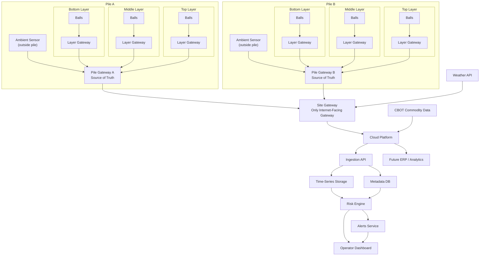
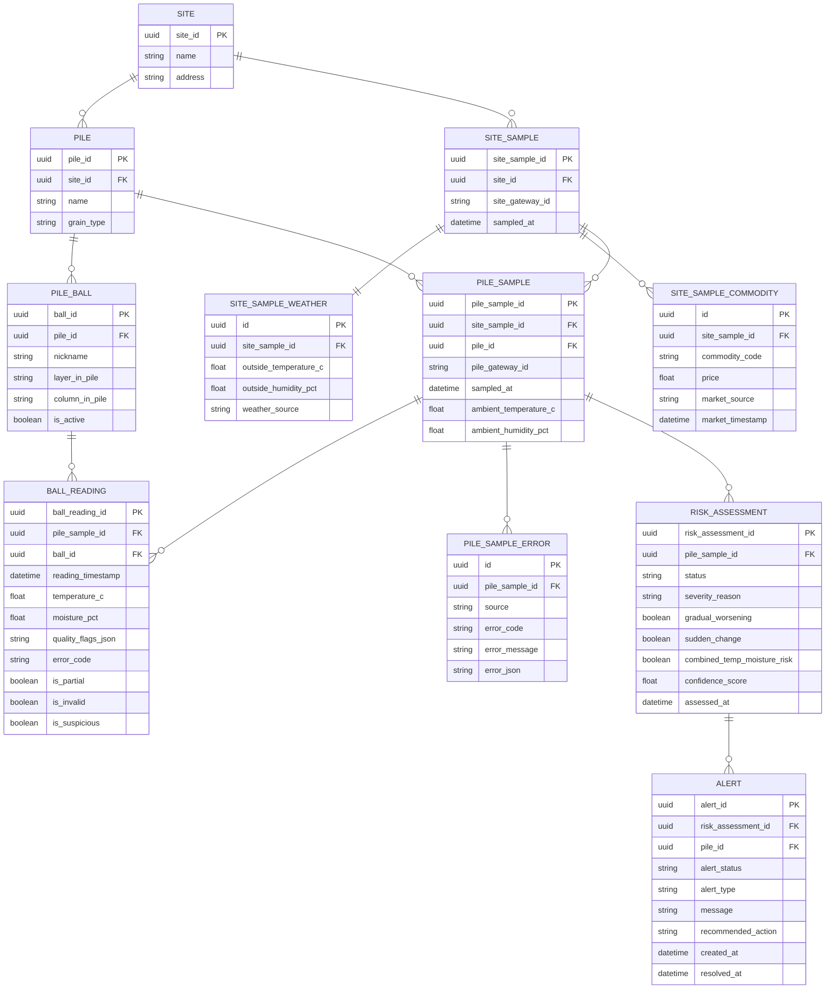

# Grain Monitoring Platform

## Overview

This platform is designed as an **edge-to-cloud grain monitoring system**.

Its purpose is to:

- collect raw readings from sensor balls inside each pile
- combine raw readings with local ambient data and external data sources
- evaluate pile risk over time
- present clear alerts to the operator

The two main design goals are:

- **Reliability**  
  The platform should continue working even when some sensors are missing, faulty, or temporarily disconnected.

- **Clarity**  
  The platform should preserve raw readings for traceability, convert them into understandable risk assessments, and support future ERP and business integrations.

---

## System Architecture

Each grain pile contains sensor balls distributed across the pile.

Their physical placement can be described in two dimensions:

- **vertical layer**
  - bottom
  - middle
  - top

- **horizontal column**
  - left
  - center
  - right

This makes it easier to understand where a sensor is located inside the pile and helps later when detecting local hotspots or moisture clusters.

Each ball reports:

- temperature
- moisture

Sampling happens every **12 hours**.

### Edge flow

At the site level:

- sensor balls send readings upward
- layer gateways collect readings from the balls in their area
- pile gateways aggregate pile-level information
- the site gateway validates payloads
- timestamps are attached consistently
- data is buffered during short connectivity issues
- batched readings are forwarded securely to the cloud ingestion API

### Cloud flow

In the cloud, the backend stores:

- raw ball readings
- ambient gateway readings
- local weather data
- CBOT commodity price data

Then the backend processes the data through these stages:

- a **risk engine** evaluates each pile using current readings and historical trends
- the result becomes a **risk assessment** for a specific pile and sampling cycle
- an **alerts service** creates operator-facing alerts
- a **dashboard API** exposes the current state of:
  - sites
  - piles
  - sensors
  - active alerts

### Why this design works

This design keeps the local side:

- simple
- resilient
- focused on ingestion

And it keeps the cloud side focused on:

- risk logic
- alerting
- long-term storage
- future integrations

---

## System Diagram

---

## Database Structure

The backend uses a **hybrid storage approach**:

- a **relational database** for operational entities, risk results, and alerts
- a **time-series structure** for sensor measurements and environmental readings

### Main entities

The main entities in the system are:

- sites
- piles
- sensor balls
- site sampling cycles
- pile sampling cycles
- ball readings
- ambient readings
- weather snapshots
- ingestion errors
- risk assessments
- alerts

### Why this structure is useful

This model keeps the business structure clear while also making trend analysis easier.

It supports analysis such as:

- rising temperature over time
- moisture trends over time
- repeated warnings
- long-term pile behavior
- data quality changes across sampling cycles
- risk concentration by area inside the pile

### Risk assessment meaning

A **risk assessment** represents the evaluated state of **one pile during one sampling cycle**.

It includes:

- the final status
- the reason for that status
- whether the change was gradual or sudden
- whether combined temperature and moisture behavior increased the risk level
- the confidence score

---

## ERD

## Reliable Data Ingestion

Reliable ingestion matters because the system must remain useful even when:

- some sensors fail
- some readings are missing
- connectivity becomes unstable

### The local gateway should

The local gateway should:

- validate incoming payloads
- attach consistent timestamps
- reject malformed messages
- buffer readings temporarily if cloud connectivity is lost
- retry uploads safely
- record communication failures
- record missing readings

### Why this matters

This helps the system distinguish between:

- a real grain problem
- a monitoring problem

For example:

- a pile may appear healthy
- but many sensors may be missing

In that case, the backend should:

- lower confidence in the result
- make the data quality issue visible to the operator

---

## Risk Logic

The risk engine should classify pile risk using **patterns**, not a single isolated reading.

### Base thresholds

Each reading is checked against the assignment thresholds:

- **Temperature**
  - below 30°C → OK
  - 30–45°C → Warning
  - above 45°C → Critical

- **Moisture**
  - below 14% → OK
  - 14–17% → Warning
  - above 17% → Critical

### Important rule

A pile should **not** be classified from one sensor value at one moment in time.

The system should examine:

- multiple balls in the same layer
- changes across time
- consistency between neighboring sensors
- whether the pattern is isolated or spreading
- whether the pattern is concentrated in a specific area of the pile

### Layer-level and area-level interpretation

Median values per layer are useful because they:

- represent the general state of the layer
- are less sensitive to random spikes than averages

At the same time, individual outlier readings should still be preserved because they may indicate:

- a local hotspot
- a moisture pocket
- an early developing issue

Because each ball also has a horizontal column position, the backend can reason not only by layer but also by area.

That means the system can identify patterns such as:

- repeated issues in the left side of the pile
- deterioration concentrated in the center
- localized risk in the top-right region

### Combined temperature and moisture risk

High temperature and high moisture together are more dangerous than either signal alone.

If both rise together in the same layer or local cluster of nearby balls, severity should escalate faster.

For example, the system may justify a pile-level warning when:

- temperature is at warning level
- moisture is at warning level
- several nearby sensors show the same pattern
- the pattern repeats across multiple sampling cycles

### Distinguishing faulty sensors from real problems

The system should avoid treating every strange reading as a real pile hazard.

To do that, it should compare suspicious readings against:

- nearby balls
- the sensor’s own recent history
- ambient conditions
- expected rate of change

A likely faulty sensor pattern is:

- one ball behaves erratically
- nearby balls remain stable

A likely real pile issue pattern is:

- several nearby balls worsen together
- the worsening continues across consecutive 12-hour cycles
- the readings form a meaningful spatial cluster inside the pile

### Gradual vs sudden deterioration

Alerts should distinguish between:

- **gradual deterioration**
- **sudden deterioration**

#### Gradual deterioration

Should escalate step by step:

- OK
- Warning
- Critical

#### Sudden deterioration

Should escalate faster, especially when:

- temperature jumps sharply
- moisture jumps sharply
- both rise together in the same layer

That pattern may indicate a developing internal hazard.

---

## External Data and Future Integrations

The platform should combine more than raw sensor-ball data.

### Additional data sources

In addition to ambient gateway readings inside the cell and weather API data for the local area, the platform should also store:

- **CBOT commodity price data**

This data is not part of the safety score itself, but it adds business context by helping estimate:

- the financial impact of spoilage risk
- downstream reporting value
- future ERP usefulness

### Another useful future source

A strong additional source would be:

- **aeration or fan operation logs**

This is useful because ventilation changes can explain changes in:

- temperature
- moisture

It also helps distinguish between:

- a real internal pile problem
- a change caused by site operations

### Future integration direction

For future expansion, processed data should be exposed through an integration layer so ERP systems can consume:

- pile status
- alerts
- historical risk data

This would allow the platform to support:

- safety decisions
- operational planning
- inventory workflows
- business reporting
